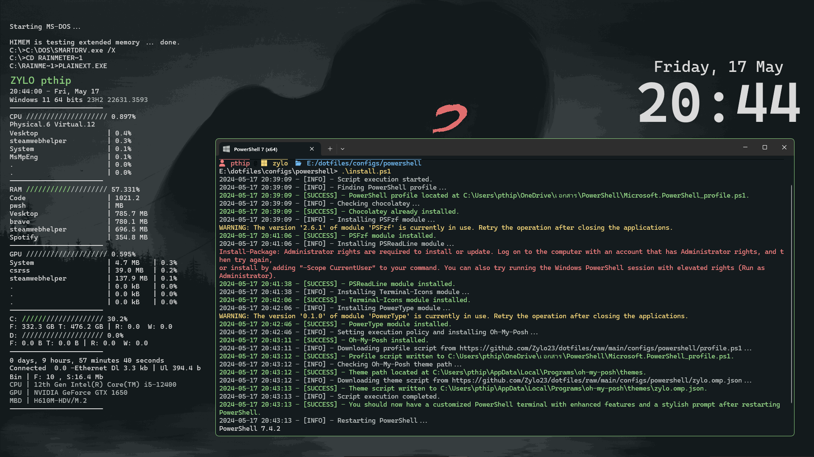

# Zylo dotfiles

Welcome to Zylo dotfiles! This repository contains various configuration files and scripts to set up customized terminal and PowerShell environments. Please read through the instructions and warnings before proceeding.

    
    <table>
        <tr>
            <td>
                
            </td>
            <td>
                
            </td>
            <td>
                
            </td>
        </tr>
        <tr>
            <td>
                
            </td>
            <td>
                
            </td>
            <td>
                
            </td>
        </tr>
    </table>

> [!WARNING]
> Use caution when installing or modifying these configurations, especially if you are not familiar with the tools and technologies involved. Incorrect configurations could affect your system's performance or functionality.

## Configurations

- [Powershell](configs/powershell)
- [Terminal](configs/terminal)
- [VS Code](configs/vscode)
- [User Styles](https://github.com/Zylo23/Everblush)

## Requirements

### Powershell Configuration

To use the PowerShell configuration, ensure you have the following prerequisites:

- **Windows Terminal**: Preferred terminal emulator for PowerShell.
- **PowerShell 7**: For enhanced scripting capabilities.
- **Nerd Font**: Recommended for icons in the terminal prompt.

Refer to [Powershell README](configs/powershell) for detailed installation instructions.

### Terminal Configuration

For configuring your terminal, you need:

- A terminal emulator capable of importing color schemes, like Windows Terminal or iTerm.
- [Nerd Fonts](https://www.nerdfonts.com/font-downloads): Install one to display icons in the prompt.

Refer to [Terminal README](configs/terminal) for more information.

### VS Code Configuration

To use the VS Code configuration, you need:

- **Visual Studio Code**: Text editor and IDE.
- **Npm**: Required for building the theme extension (or other package managers).

Refer to [VS Code README](configs/vscode) for detailed installation instructions.

### User Styles

User styles are used to customize the user interface of websites. They are usually installed as browser extensions.

- [Stylus](https://github.com/openstyles/stylus): Required for installing the theme.

Refer to [User Styles README](https://github.com/Zylo23/Everblush/tree/main/userstyles/styles) for detailed installation instructions.

## How to Use

Each directory contains a README.md file with detailed instructions on how to set up and use the configurations. Please read these files carefully before proceeding with installation or modifications.

## Additional Information

Feel free to customize the configuration files to suit your preferences. If you encounter any issues or have questions, please create an issue in this repository, and we will be happy to assist you.

---

For any questions or feedback, you can reach out to [Zylo23](https://github.com/Zylo23).
